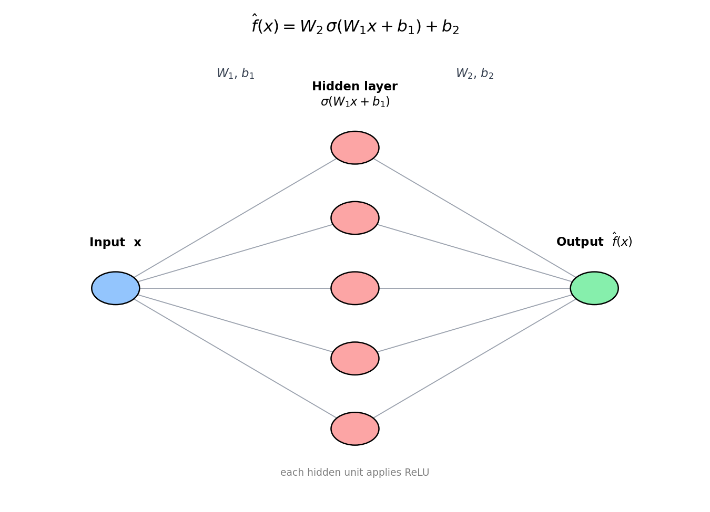
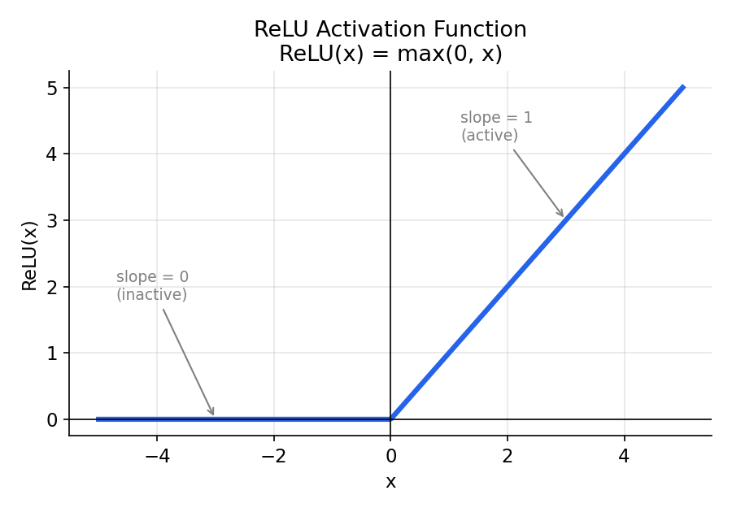
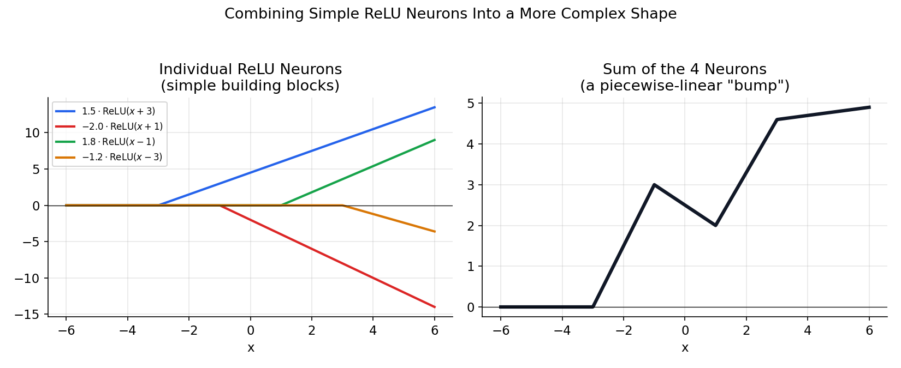
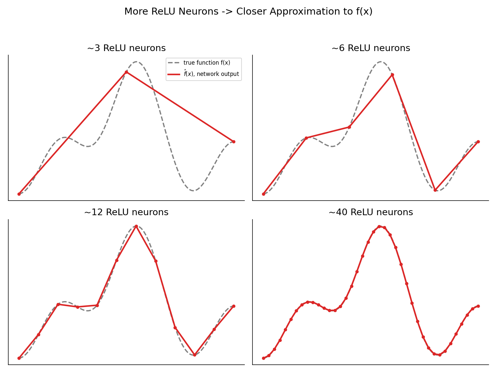
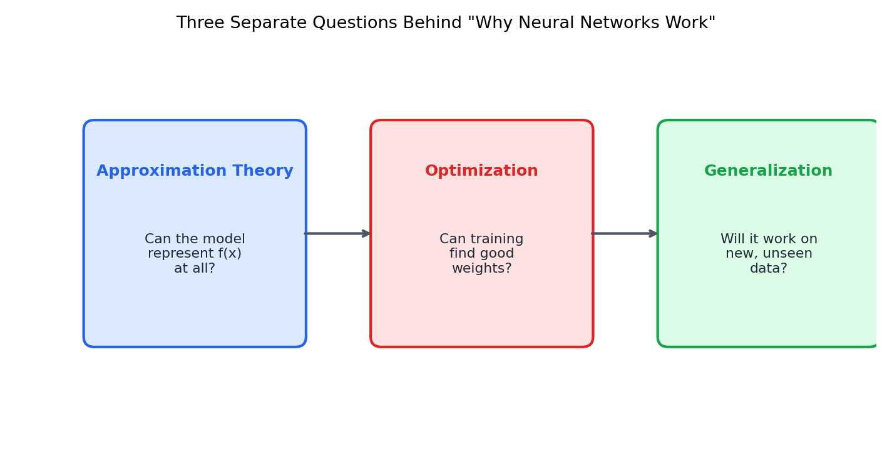

# Approximation Theory in Machine Learning

*Why can a neural network learn "almost any" relationship between inputs and outputs? The answer lives at the intersection of approximation theory, optimization, and generalization — this repo focuses on the first piece.*

---

## Table of Contents

1. [The Basic Idea](#1-the-basic-idea)
2. [Where Neural Networks Come In](#2-where-neural-networks-come-in)
3. [Why ReLU Matters](#3-why-relu-matters)
4. [The Universal Approximation Theorem](#4-the-universal-approximation-theorem)
5. [Visual Intuition](#5-visual-intuition)
6. [Benefits of Understanding Approximation Theory](#6-benefits-of-understanding-approximation-theory)
7. [Approximation vs. Optimization vs. Generalization](#7-approximation-vs-optimization-vs-generalization)
8. [Minimal Code Example](#8-minimal-code-example)
9. [Key Takeaways](#9-key-takeaways)
10. [Further Reading](#10-further-reading)

---

## 1. The Basic Idea

Every supervised learning problem assumes there is some **true, unknown function** connecting inputs to outputs:

```
y = f(x)
```

For example:

```
house features  →  price
image pixels    →  cat / dog
audio waveform  →  transcribed text
```

We never see `f` directly — we only see examples `(x, y)` drawn from it, often with noise. A machine learning model builds an **approximation** of `f`:

```
f̂(x) ≈ f(x)
```

The whole point of training is to shrink the approximation error:

```
| f(x) − f̂(x) |
```

**Approximation theory** is the branch of mathematics that asks: *given a class of functions we're allowed to use (e.g., polynomials, splines, or neural networks), how well can we represent an arbitrary target function `f`, and how many "resources" (parameters, neurons, layers) does that require?*

This is a question about **representational capacity** — it says nothing yet about whether we can actually *find* the right approximation through training, or whether it will hold up on new data.

---

## 2. Where Neural Networks Come In

A neural network is, mathematically, just a parameterized function. The simplest useful example — a single hidden layer network — looks like:

```
f̂(x) = W₂ σ(W₁x + b₁) + b₂
```

| Symbol | Meaning |
|---|---|
| `W₁, W₂` | weight matrices |
| `b₁, b₂` | bias vectors |
| `σ`      | nonlinear activation function (e.g., ReLU) |
| `f̂(x)`  | the function the network currently computes |



*Input `x` is linearly transformed (`W₁x + b₁`), passed through a nonlinearity `σ`, and linearly transformed again (`W₂ · + b₂`) to produce the output. Training adjusts `W₁, W₂, b₁, b₂` so that `f̂(x) ≈ f(x)`.*

Without the nonlinearity `σ`, stacking linear layers would collapse into a single linear transformation — no matter how many layers you add, `f̂` could only ever represent straight lines / planes. The nonlinearity is what gives the network the ability to bend, and that's where ReLU comes in.

---

## 3. Why ReLU Matters

**ReLU (Rectified Linear Unit)** is defined as:

```
ReLU(x) = max(0, x)
```

It is zero for negative inputs and behaves like the identity function for positive inputs.



On its own, a single ReLU neuron just produces one "kink" — a function that is flat, then suddenly starts increasing (or vice versa, depending on the sign of the weight). That's not very expressive by itself. The real power shows up when you **combine many ReLU neurons**:

```
a₁·ReLU(w₁x + b₁) + a₂·ReLU(w₂x + b₂) + a₃·ReLU(w₃x + b₃) + ...
```

Each term contributes one linear "piece" with its own breakpoint (determined by `w` and `b`) and its own slope/direction (determined by `a`). Summing many of them stitches these pieces together into an arbitrarily complex **piecewise-linear function**.



*Left: four individual scaled/shifted ReLU neurons, each contributing one "kink." Right: their sum produces a piecewise-linear bump shape — a much more expressive function than any single neuron could represent.*

### Why ReLU specifically (benefits over alternatives like sigmoid/tanh)

- **No vanishing gradient (for positive inputs).** The gradient of ReLU is exactly `1` when active, so gradients propagate cleanly through deep networks. Sigmoid/tanh saturate and squash gradients toward zero, which slows or stalls learning in deep networks.
- **Cheap to compute.** `max(0, x)` requires no exponentials, unlike sigmoid or tanh — this matters a lot at the scale of millions/billions of neurons.
- **Piecewise-linear = easy to reason about.** A ReLU network's output is literally a continuous piecewise-linear function of its input. This makes the connection to approximation theory very concrete: more neurons → more linear pieces → finer approximation.
- **Sparsity.** Because ReLU outputs exactly `0` for negative inputs, at any given input only a subset of neurons are "active." This gives useful inductive bias and can make representations more efficient.
- **Empirically, it just works well.** ReLU and its variants (Leaky ReLU, GELU, SiLU/Swish) are the default choice in most modern deep networks for these reasons.

**Trade-off to be aware of:** a ReLU neuron that always outputs `0` for every training example ("dying ReLU") stops learning, since its gradient is zero everywhere it's inactive. Variants like Leaky ReLU (`max(αx, x)`) address this.

---

## 4. The Universal Approximation Theorem

This is one of the foundational results in neural network theory. Informally:

> **A feedforward neural network with a single hidden layer, containing a finite (but possibly large) number of neurons and a suitable nonlinear activation function, can approximate any continuous function on a compact input domain to arbitrary accuracy.**

Formally, for any continuous `f` on a compact set, and any `ε > 0`, there exists a network `f̂` such that:

```
| f(x) − f̂(x) | < ε      for all x in the domain
```

### What this does *not* say

This theorem is about **existence**, not about **construction**:

- ❌ It does **not** say gradient descent (or any training algorithm) will actually *find* that network.
- ❌ It does **not** say the number of neurons required is small or practical — it could be astronomically large for a given `ε`.
- ❌ It does **not** say the resulting model will **generalize** to data it hasn't seen.
- ✅ It **does** say that lack of representational capacity is not fundamentally why simple neural networks fail — the function you want almost certainly *can* be represented, in principle.

This is exactly why approximation theory is only one leg of the stool — see [Section 7](#7-approximation-vs-optimization-vs-generalization).

---

## 5. Visual Intuition

Imagine the target function `f(x)` is some smooth curve with a hill shape. A neural network builds its approximation `f̂(x)` out of straight-line pieces, and as you add more ReLU neurons, those pieces get finer and hug the curve more closely.



*Gray dashed = the true function `f(x)`. Red solid = the network's piecewise-linear approximation `f̂(x)`. With only 3 neurons the fit is crude; by ~40 neurons the approximation is visually indistinguishable from the target. This is the Universal Approximation Theorem made concrete: width (number of neurons) buys you approximation accuracy.*

In higher dimensions the same idea holds, just harder to draw: instead of linear *segments*, ReLU networks partition the input space into linear *regions* (polytopes), and the network is piecewise-linear on each region.

---

## 6. Benefits of Understanding Approximation Theory

Knowing *why* neural networks can approximate complex functions is not just a theoretical curiosity — it has practical payoffs:

- **Architecture intuition.** It explains why increasing width or depth increases representational power, and why very narrow/shallow networks might simply be incapable of representing the target function, regardless of how well you train them.
- **Diagnosing failure.** When a model underperforms, approximation theory helps you distinguish *"my model can't represent this function"* (capacity problem) from *"my model can represent it but training didn't find it"* (optimization problem) or *"it fit the data but doesn't generalize"* (generalization problem).
- **Justifying depth over width.** Later results (beyond the classic 1989 theorem) show that *deep* networks can approximate certain function classes *exponentially* more efficiently (fewer total neurons) than shallow ones — motivating why modern architectures are deep rather than just wide.
- **Choosing activation functions.** Approximation-theoretic and gradient-flow arguments both feed into why ReLU-family activations dominate in practice.
- **Setting expectations.** It tells you approximation error can, in principle, be driven arbitrarily low — so persistent error is more likely coming from limited data, optimization difficulty, or genuine label noise than from the model's representational ceiling.

---

## 7. Approximation vs. Optimization vs. Generalization

These three concepts are often conflated but ask fundamentally different questions:



| Question | Field | Example concern |
|---|---|---|
| **Can the network represent the function at all?** | Approximation theory | Is there *any* setting of weights that gets close to `f`? |
| **Can we find good weights?** | Optimization | Does gradient descent converge to a good solution given non-convex loss landscapes? |
| **Will it work on new data?** | Generalization / statistical learning theory | Did the model learn the true pattern, or just memorize the training set? |

A model can ace one of these and fail another — e.g., a huge network might be perfectly *capable* of representing `f` (approximation ✅), yet overfit badly and generalize poorly (generalization ❌), or get stuck in a poor local region during training (optimization ❌).

---

## 8. Minimal Code Example

A tiny, self-contained example showing a ReLU network fitting a 1-D function — the same idea as the plots above, but actually trained with gradient descent (PyTorch):

```python
import torch
import torch.nn as nn

# Target function we're trying to approximate
def f(x):
    return torch.sin(x) + 0.3 * x

# Training data
x_train = torch.linspace(-6, 6, 200).unsqueeze(1)
y_train = f(x_train)

# A small ReLU network: 1 -> 64 -> 64 -> 1
model = nn.Sequential(
    nn.Linear(1, 64), nn.ReLU(),
    nn.Linear(64, 64), nn.ReLU(),
    nn.Linear(64, 1),
)

optimizer = torch.optim.Adam(model.parameters(), lr=1e-3)
loss_fn = nn.MSELoss()

for epoch in range(2000):
    y_pred = model(x_train)          # f̂(x)
    loss = loss_fn(y_pred, y_train)  # |f(x) - f̂(x)|²
    optimizer.zero_grad()
    loss.backward()
    optimizer.step()

print(f"Final MSE: {loss.item():.6f}")
```

As training progresses, `loss` should shrink toward zero — a live demonstration of `f̂(x) → f(x)`.

---

## 9. Key Takeaways

- The goal of a machine learning model is to approximate an unknown function `f` mapping inputs to outputs.
- A neural network is literally a parameterized function `f̂(x) = W₂σ(W₁x + b₁) + b₂`; training tunes the parameters to minimize approximation error.
- **ReLU** turns the network into a piecewise-linear function; combining many ReLU neurons builds up arbitrarily complex shapes out of simple linear pieces.
- The **Universal Approximation Theorem** guarantees that a large-enough network *can* represent essentially any continuous function on a bounded domain — but this is a statement about *capacity*, not about training success or generalization.
- Understanding approximation theory separately from optimization and generalization gives you a clearer mental model for diagnosing why a model does or doesn't work.

---

## 10. Further Reading

- Cybenko, G. (1989). *Approximation by Superpositions of a Sigmoidal Function.* — the original universal approximation result.
- Hornik, K. (1991). *Approximation Capabilities of Multilayer Feedforward Networks.*
- Telgarsky, M. (2016). *Benefits of Depth in Neural Networks.* — why deep networks can be exponentially more efficient than shallow ones.
- Lu, Z. et al. (2017). *The Expressive Power of Neural Networks: A View from the Width.*
- MIT OpenCourseWare — Approximation Theory / relevant numerical analysis and machine learning course materials.

---

*Diagrams in this repository were generated programmatically (see `make_images.py`) to illustrate the concepts discussed above.*
